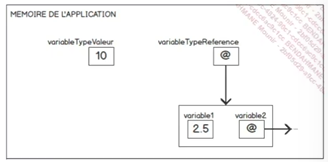

# JAVA

Java : 

- Langage système simple, orienté objet
- Optimiser les tps de cycle des developpements (Compilation et Executation)
- Les app produites sont portables (cross plat)
-  Gst mém et err simplifiée par rapport à C++ 
- Créer des app multi threads
- App Robuste et sécure et vérif des bytecodes <--- (à Def)

## Plateforme Java

- SE = Standard Edition 
- JDK = Dev kit
- API 
- Javac = Compilateur
- JRE  = Environnement exe installer sur la machine client (Runtime Environnement)
- JVM = Java virtual machine, permet l'exe du prog et pass en param la commande `java`

## Machine Virtuelle Java

Mise à dispo pour multiple OS.

#### Ses roles sont multiples

 - Charge des classes (et bytecodes), instanciation d'une classe et bytecodes à interprêter
 - Gère la mem : Pointeur et Ref. Gère la lib de mem : `Garbage Collector`
 - Gère la sécu 
 - Interface code natif

 ## l'API JAVA

 Ensemble de logiciels pré conçu pour fournir un grnd nbr de fcté.

 L'API JAVA 17 :

 - 21 modules
 - 220 packages (L'équivalent des biblio de classes en C# ou lib C) 
 - Plus de 4000 classes et interfaces à dispo
 
 ### Deux implémentations pour une plateforme

  - Oracle JDK
  - OpenJDK 


Il est recommandé d'ajouter `JAVA_HOME`en tant que variable d'environnement

```
C:\Users\Dev\Desktop\Java\JDK
```


## L'IDE
IntelliJ ou Eclipse

## MySQL

- on premise
- avec wamp (mamp, camp, ...)
- avec Docker
- dans le cloud
- ... 

## Votre premier programme en JAVA   


Un programme java est une collection de fichiers java destinés à fonctionner ensemble.
Image2


Il faut plusieurs étapes pour l'exécution d'un programme JAVA :  
    
Compilation : code source (en java) -> bytecode (langage intermédiaire). Le bytecode n'est pas du binaire.

    
C'est la JVM qui charge le bytecode et le compile à la volée (JIT : just in time) pour exécuter du code qui sera compréhensible par la machine hote.


#### **Hello world** : 
```
package test;

public class Main {

	public static void main(String[] args) {
		System.out.println("Hello World");

	}

}
``` 


 ### Les variables en java

instance de classe :  l'objet crée à partir d'une classe

Les categories de variables :

- **Les variables d'instance** : n'existe que si une unstance de classe est disponible. Chaque isntance possède sa propre version de la variable

- **Les variable de classe** : elles sont aussi declarees à l'interieur d'une classe mais avec le mot clé `static`. La variable de classe est disponible directement depuis la classe et existe en un exemplaire unique. On peut avoir 50 instances d'une même classe, mais la valeur d'une variable de classe est unique.

- **Les variables locales** : sont déclarées à l'intérieur d'une méthode.

## Nomenclature Variable
- Nom variable commence avec lettre
- Lettres, chiffres et underscore
- Nombre illimité de caractères
- case sensitive 
- keywords
- camel case

#### Les types de variables : 

On distingue deux types de variables : 
- Types valeur : stock des valeurs 
- Typ ref : ne stock pas de valeur




Les types valeur = type primitif : 

- entiers
- décimaux
- char 
- bool


### La déclaration :

En java :

``` java
[modificateurs] type maVariable;
```

on peut déclarer plusierus variable sur même ligne

``` java
type var1, var2, var3, var 4;
```

Exemple: 

``` java
int age;
Date armistice, noel; 
```

Type valeur, lors de réassignation ne change pas la valeur de la seconde variable

Type ref, la valeur change après réassignation 

### Pour initialiser une variable

``` java
int nbr = 1 ;
```

### Les types entiers


### Les types décimaux


### Les constantes

Il arrive que des variables ne doivent pas être modifiées au cours de l'execution du programme :

Il convient alors de définir des constantes.

Pour définir une constante on utilise le mot clé `final`: 

``` java
final double PI = 3.14159265;
```

- Init constante obligatoire lors de la déclaration. 
- Constante souvent défini en statique. 
- Ecrit en majuscule par convention

### Les énumérations : 

Permet de def un ensemble de constante

```java
{
    JANVIER,
    FEVRIER,
    MARS,
    AVRIL,
    MAI,
    JUIN,
    JUILLET,
    AOUT,
    SEPTEMBRE,
    OCTOBRE,
    NOVEMBRE,
    DECEMBRE
}
```

Equivalent avec une classe : 

```java
public class Month
{
    public static final int JANVIER = 0 ;
}
``` 

La déclaration d'une enum  = utilisation d'une "classe cachée" 


### Tableau

```java
int [] unTableau;

//Doit préciser taille
//Entre crochet
unTableau = new int[122];

// Pas besoin de préciser, auto déter
int[] autreSyntaxe = {3,4,5,6,7};
```

On peut accéder aux éléments : 

```java
autreSyntaxe[4];
```

Index inextistant:

`ArrayIndexOutOfBoundException`

Possible de travailler avec des tableaux à plusieurs dimensions : 

Syntaxe pour récup élément dans tableau 2D 

```java 
int elemTableau2D =  tableau2[0][1] ; 
``` 

autres méthodes de création : 

```java
int[][] matrice;
matrice = new int[2][];
matrice[0] = new int [4];
matrice[1] = new int [4];
```

Autre syntaxe pas recommandé
```java
int [][] encoreUneAutreSyntaxe = {{1,3,4},{23,21,25}}
```